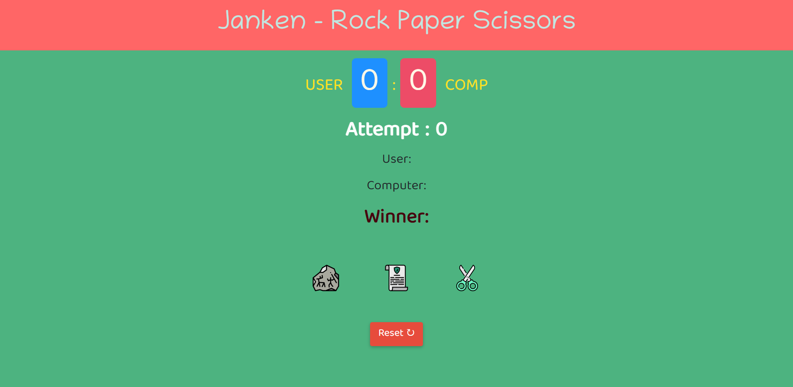

# Rock-Paper-Scissor Game

Hello There,

I'm `Adnan Sarkar`. This is Rock-Paper-Scissor Game and javascript DOM short project. This game is simply based on user & computer(bot), where the computer will select an option after the user's selection.
## 🛠 Technologies Used
- 
- 
- 

## 🖥 Preview
[Live Preview]()

##  What I have learned in this project?
- DOM Manipulation

## ⏲ Time to finish the project
It took me around 2 hours to complete this project.

## 📢 Social Links
- 
- 
- 
- 
- 